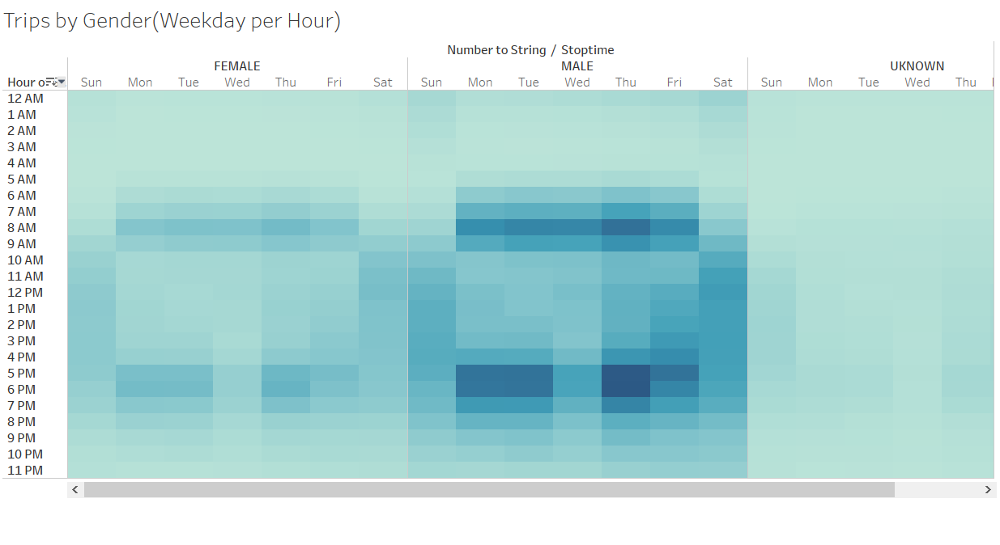

# bike_sharing

# Purpose 

This project was an analysis of the data for a bike sharing application centered around New York. THe investors of the company were hoping to expand the cities in which this program was hosted and were looking to see if the same program in Des Moines would work and asked to see an analysis of the bike trip data. The full analysis can be seen here: https://public.tableau.com/profile/eric.ralston#!/vizhome/Book1_16026138219620/Story1?publish=yes

# Results

Five new visualizations were created in this exercise in order to analyze the data. In the below visualization 
We can see the length of time that users checked out their bikes for. We can see how the number ramps up rapidly from 0 hours before reaching a peak at 5 hours before slowly descending again.

In the next visualization  we analyzed how gender might play a part in the checkout time for the bikes. In the visualization we can see how the count for the males is significantly higher than the count for the females. This can be explained by males taking up the major part of customers for the application. In checking the tendency for genders for the whole journey we can see how they are relatively similar with both genders increasing the number of users per hour from 0 to five before decreasing again. From this it is hard to say that gender plays a part in how likely someone is to checkout a bike for a longer/shorter duration.

In the next visualization  we analyzed the frequency by which users checked out bikes by hour per weekday. In the visualization we can see clearly that for Monday through Friday the most common checkout times are between 7-9am and 5-6pm. This can be explained by people using the bikes to commute to and from work. By contrast one the weekend the most common checkout times are between 10am and 5pm, the most common times for people to do leisure activities.

In the next visualization we added gender as a component to the previous visualization to see if this played a factor in the time in which people checked out bikes: . Based upon this data we can see a clear correlation between the checkout times between the two genders. It does not seems as if Gender plays a role in when people are most likely to checkout bikes. 

# Analysis 

The visualizations were very useful in giving the investors a snapshot of user behavior. In order to best maximize the effectiveness of the analysis two additional visualizations that may have been useful were to see how checkout time by district may have played a role, in order to determine how density of population played a role in people checking out bikes. The data seemed to lend itself to the idea that many of the users were using the bikes to commute to and from work during the weekdays as well. Due to this it would have been useful to see if density of traffic played a role in the number of bikes checked out. In order to determine this we would need to pair up the user data along with traffic data for the area to contrast number of bikes on the road at a given time versus the number of cars on the road at the same time
